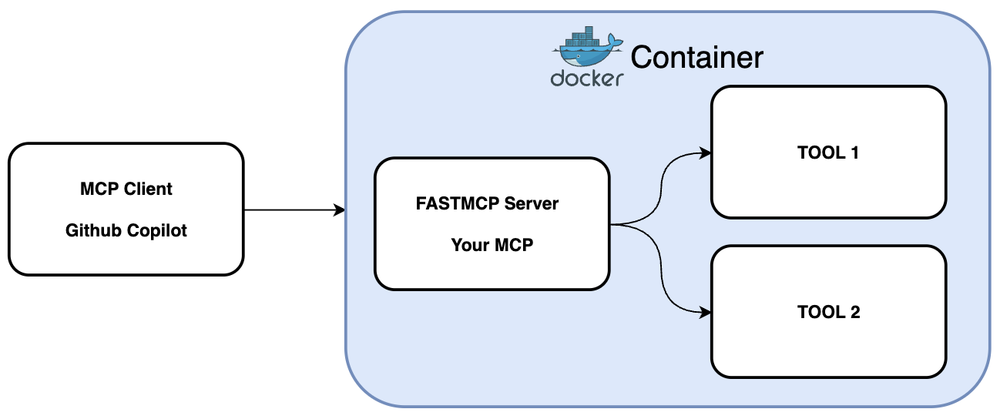

# FastMCP Starter Kit

A simple Model Context Protocol (MCP) server starter kit built with FastMCP.



## Features

- Simple MCP server implementation using FastMCP
- Example tool: `get_author_name` - Returns the author name of this MCP server
- Easy to extend with additional tools and functionality

## Installation

1. Fork and Clone this repository.

2. Install dependencies using uv (recommended):
```bash
uv sync
```

Or using pip:
```bash
pip install -e .
```

## Usage

### Running the MCP Server

Start the server using:
```bash
docker compose up -d
```

### VS Code Configuration

To use this MCP server with GitHub Copilot in VS Code, create a `.vscode/mcp.json` file in your project root:

```json
{
  "servers": {
    "fastmcp-starter-kit": {
      "command": "npx",
      "args": ["-y", "mcp-remote", "http://localhost:8100/sse", "--allow-http"]
    }
  }
}
```

**Important Notes:**
- Make sure your MCP server is running on the port specified in the configuration.
- If you're running the server on port 8000 (default), update the URL to `http://localhost:8000/sse`
- The `--allow-http` flag is required for local HTTP connections

Once you have the MCP server running, you can connect it to GitHub Copilot to access the custom tools. Here's how it looks in GitHub Copilot:


## Development

To add new tools to your MCP server:

1. Add new tool functions in `src/server.py` using the `@mcp.tool()` decorator
2. Restart the server
3. The new tools will be automatically available to connected clients

Example:
```python
@mcp.tool()
async def my_new_tool(param: str) -> str:
    """Description of what this tool does."""
    return f"Processed: {param}"
```
